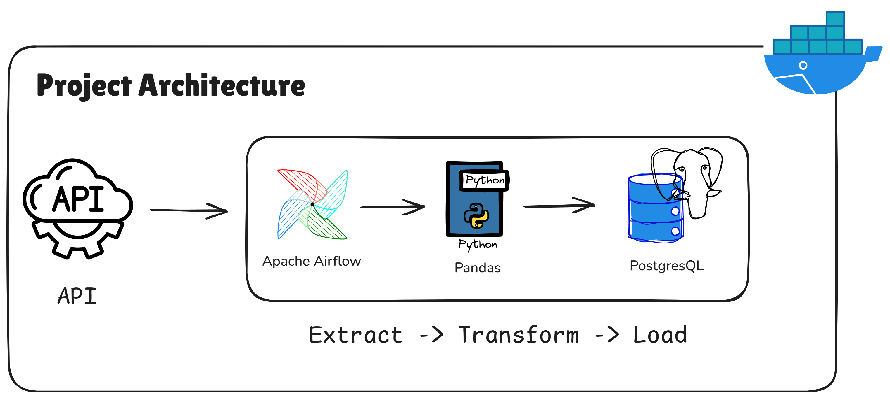

# Automated Indonesian Weather ETL Pipeline with Apache Airflow

Building an automated data pipeline to collect weather conditions across various cities in Indonesia every 1 hour using **Apache Airflow**

## 🚀 Key Features

- Users can define target cities without modifying the code
- Data is updated every 1 hour
- Stores final processed data into a PostgreSQL database
- Automatic email alerts for success/failure

## 🛠️ Implementation
1. Designing a modular ETL pipeline: extract, transform, and load.
2. Using Apache Airflow as the orchestrator for scheduling and dependency management.
3. Integrating a weather API to retrieve weather data from cities across Indonesia
4. Storing transformed data into PostgreSQL.
5. Implementing email alerts for pipeline monitoring (success & failure notification).

## 🔄 Workflow (Pipeline)
1. Extract
    - Retrieve weather data from API based on cities in Indonesia
    - Store raw data in JSON format.
2. Transform
    - Clean and structure the data.
    - Normalize data format to be ready for storage.
3. Load
    - Insert final data into PostgreSQL.
    - Trigger email notification if successful.
4. Monitoring
    - Failure → email alert containing error details.
    - Success → email confirmation that the pipeline runs normally.

## 💻 Technology Used
- Python
- Apache Airflow
- PostgreSQL
- Docker
- Simple Mail Transfer Protocol (SMTP)

## ⚠️ Challenges & Solutions
1. Challenge 1: API Data Variability
    - API data structure can change or be inconsistent.
    - **Solution:** Implement a transformation layer for schema normalization.
2. Challenge 2: Pipeline Failure Visibility
    - Without monitoring, errors are difficult to detect.
    - **Solution:** Airflow-based email alerts with detailed error messages.
3. Challenge 3: Scalability for Multiple Cities
    - Hardcoding cities is not scalable.
    - **Solution:** Use Airflow params to input desired cities.
4. Challenge 4: Environment Configuration
    - Sensitive credentials (email, API, DB).
    - **Solution:** Use `.env` for secure configuration management.

## 📊 Impact / Result
- Pipeline runs automatically every hour without manual intervention.
- Historical weather data is stored consistently in PostgreSQL.
- Monitoring improves pipeline reliability (failures are detected immediately).
- Ready to be used as a data source for:
    - Dashboard (BI tools)
    - Machine learning models (weather prediction)
    - Data analytics

## 🔮 Future Improvements
- Integration with data warehouse (BigQuery / Snowflake).
- Addition of data validation & anomaly detection.
- Implementation of centralized logging (ELK / Grafana).
- Real-time dashboard for pipeline monitoring.
- Parallel processing to improve performance as the number of cities increases.
- Integration with streaming pipelines (Kafka) for near real-time ingestion.
